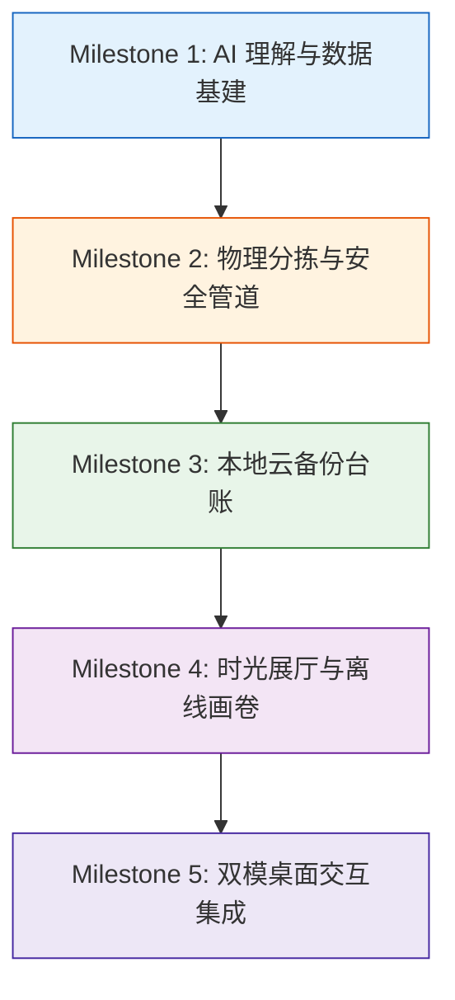

# Photoye 全局开发路线图 (ROADMAP V3.0)

> **定位:** 项目全生命周期宏观规划总览  
> **需求对照:** 100% 承接 `zlog/REQUIREMENTS.md` (FRD V3.0) 规格，长期稳定，作为全局对照总账

---

## 🗺️ 里程碑全景 (Milestones)

---

## 阶段详解与功能矩阵

### 阶段一：AI 理解与数据基建 (Milestone 1)
*对应需求：模块一 (F1.1, F1.2, F1.3)*

| 编号 | 功能模块 | 关键交付项 | 验证指标 / 验收标准 | 状态 |
| :--- | :--- | :--- | :--- | :--- |
| **M1-F1** | SQLite V3.0 数据持久层 | 照片、伴侣文件、多姿态人物、人脸、台账五表及索引 | 内存 DB 单元测试全覆盖 (增删改查/级联/序列化) | ✅ 已完成 |
| **M1-F2** | 熟人底库与多姿态质心 | 正脸/侧脸双质心维护、余弦比对、移动平均更新、DBSCAN增量聚类 | 双质心比对测试、离群路人噪声过滤测试 | ✅ 已完成 |
| **M1-F3** | 自适应人像感知引擎 | 基于 5 点关键点偏航角(Yaw)与俯仰角(Pitch)评估、多姿态人脸抽取 | 16张多角度真实图片检测、侧脸及俯仰角姿态正确识别 | ✅ 已完成 |
| **M1-F4** | OpenCLIP 场景分类 | 纯风光/美食/宠物等无人物题材分类、人脸与风景交叉纠错 | 纯风景零误报、有人脸照片强制纠偏为单人/合照 | ✅ 已完成 |
| **M1-F5** | 本地开放式语义搜索 | 纯本地 ONNX 文本编码、Prompt Ensemble、自然语言毫秒搜图 | 输入自然语言生活描述，Top-K 准确召回相关照片 | ✅ 已完成 |

---

### 阶段二：多维规则物理分拣引擎 (Milestone 2)
*对应需求：模块二 (F2.1, F2.2, F2.3, F2.4)*

| 编号 | 功能模块 | 关键交付项 | 验证指标 / 验收标准 | 状态 |
| :--- | :--- | :--- | :--- | :--- |
| **M2-F1** | EXIF 与伴侣文件探测 | EXIF 拍摄时间/GPS 解析、同名动态视频(.MOV)及调色/RAW文件配对 | 伴侣文件与主照片捆绑为原子操作单元，同进同退 | ⏳ 待开始 |
| **M2-F2** | 多维规则分发管道 | 按人物定向分拣 (合影1对多扇出)、按题材归集、按年月层级归档 | 同一张合影自动分送多个目标目录，分类树结构规范 | ⏳ 待开始 |
| **M2-F3** | 存储操作模式 | 同磁盘优先 `os.link` 硬链接 (0空间占用)、跨磁盘流式复制 | 秒级完成整理，重名文件自动递增序号防止覆盖 | ⏳ 待开始 |
| **M2-F4** | 事务审计与一键撤销 | 写入 `photoye_run_<timestamp>.undo.json` 事务清单、回滚引擎 | 误操作支持一键完全原路复原，零文件残留或损坏 | ⏳ 待开始 |
| **M2-F5** | 独立分包打包导出 | 整理产物按人物/分类分别压缩为独立 ZIP 文件 | 适合微信/网盘直接发送，解压校验完整性 | ⏳ 待开始 |

---

### 阶段三：本地云备份台账 (Milestone 3)
*对应需求：模块三 (F3.1, F3.2, F3.3)*

| 编号 | 功能模块 | 关键交付项 | 验证指标 / 验收标准 | 状态 |
| :--- | :--- | :--- | :--- | :--- |
| **M3-F1** | 分块数字指纹账本 | 分块流式 SHA-256 计算、关联云平台/相册名称/完成时间戳 | 文件改名或移位后，基于指纹依然稳定识别备份状态 | ⏳ 待开始 |
| **M3-F2** | 漏传对账与系统调起 | 筛选特定相册未备份清单、调用 Windows 资源管理器一键全选目标 | 自动唤起 `explorer.exe /select`，方便用户直接拖拽上传 | ⏳ 待开始 |
| **M3-F3** | 备份状态同步与检索 | 一键批量标记为已完成、扫除从未上传任何云端的备份盲区 | 漏传照片检索零遗漏 | ⏳ 待开始 |

---

### 阶段四：时光回忆与浏览展厅 (Milestone 4)
*对应需求：模块四 (F4.1, F4.2, F4.3, F4.4, F4.5)*

| 编号 | 功能模块 | 关键交付项 | 验证指标 / 验收标准 | 状态 |
| :--- | :--- | :--- | :--- | :--- |
| **M4-F1** | 时间线与那年今日 | 按年月日自然流式组织、往年今日历史回忆卡片提取算法 | 正确计算历史同月同日跨年份照片集合 | ⏳ 待开始 |
| **M4-F2** | 离线时空足迹相册 | 纯本地逆地理编码数据库 (EXIF GPS 转省/市/区/景点) | 零网络依赖，秒级将经纬度转换为中文标准地名 | ⏳ 待开始 |
| **M4-F3** | 人物生活回忆录 | 调取人物底库、按岁月纵向串联特定人物生活切片 | 过滤并输出指定人物在各时期的高清代表照片流 | ⏳ 待开始 |
| **M4-F4** | 独立离线画卷导出 | 自包含独立 `回忆画卷.html` 离线故事页面生成器 | 单文件直接双击在任何浏览器中播放动画幻灯 | ⏳ 待开始 |

---

### 阶段五：交互体验与双模桌面集成 (Milestone 5)
*对应需求：模块三 (UI & Workflow 3.1)*

| 编号 | 功能模块 | 关键交付项 | 验证指标 / 验收标准 | 状态 |
| :--- | :--- | :--- | :--- | :--- |
| **M5-F1** | 极简双分区开屏外壳 | 左右大卡片分流（智能分拣工坊 / 时光回忆展厅） | 拖入文件夹直达目标模式，无冗余配置 | ⏳ 待开始 |
| **M5-F2** | 智能分拣工坊视图 | 规则配置选择、实时分拣预览卡片、进度条与撤销弹窗 | 直观显示合影扇出目标，一键执行分拣 | ⏳ 待开始 |
| **M5-F3** | 时光展厅与瀑布流视图 | 沉浸式流畅瀑布流、那年今日浮窗、足迹地图相册、人物画廊 | 界面响应流畅，异步缩略图平滑加载 | ⏳ 待开始 |
| **M5-F4** | 云备份台账管理面板 | 平台与相册对账视图、一键标记、一键调起文件管理器 | 操作流畅直观 | ⏳ 待开始 |
